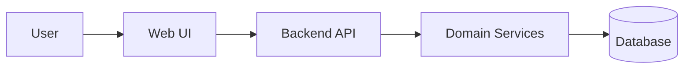
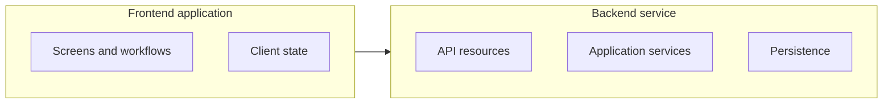

# Diagram Style Guide

## Mermaid defaults
Use Mermaid for direct chat diagrams.

Preferred diagram types:
- `flowchart LR` for system/container/deployment/function overviews
- `flowchart TD` for layered decomposition or user flows
- `sequenceDiagram` for runtime scenarios
- `classDiagram` or `erDiagram` for information models
- `stateDiagram-v2` for lifecycle/state

## Mermaid overview pattern



## Grouping with subgraphs



## Labeling rules
- Prefer human-readable labels.
- Include technical names in parentheses only when useful.
- Avoid long labels.
- Put details in tables, not diagram nodes.

## ASCII fallback pattern

```text
[User]
  |
  v
[Web UI] --> [Backend API] --> [Domain Services] --> [(Database)]
```

## When not to use Mermaid
Avoid Mermaid when a table is clearer, the diagram exceeds about 12 main nodes, many-to-many relationships dominate, precise chart positioning is required, or the view is a scored quadrant.
